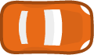

# Rusty Engine Tutorial

---

**Rusty Engine** is an open-source game engine created by wrapping a simplification layer around the [Bevy Engine](https://bevy.org/). It is designed to be beginner-friendly, making it easier for new developers to get started with game development in Rust. _Bevy_ is a powerful game engine (real one) that is more complex and has a steeper learning curve, while _Rusty Engine_ aims to provide a more accessible entry point.

**Rusty Engine** purpose in life is to provide a simple Rust interface so you can play around with Rust without the game engine getting in the way.

---

## [Rusty Engine Tutorial Page](https://github.com/CleanCut/rusty_engine)

In the tutorial page, you can find out how to use the engine. We will cover the whole thing in tutorial videos also, but the page will always be up to date, while the videos may not be.

---

## Configuration

---

**1. Add the `rusty_engine` dependency to your `Cargo.toml` file:**

```toml
[dependencies]
rusty_engine = "6.0.0"
```

**2. Download the asset pack:** This will contain all the necessary assets (static) for the tutorial. You can find it in the [Rusty Engine Repo](https://github.com/CleanCut/rusty_engine/archive/refs/heads/main.zip)

**3. Unzip and move the assets:** Unzip the folder, this will give you the whole of the `rusty_engine` repo, then you can move the `assets` folder to your project root. The structure should look like this:

```bash
your_project/
├── Cargo.toml
├── src/
|    ├── main.rs
├── assets/
```

If you are in workspace, better go with 'string' representation of the path. There is some conflict with the default path. You need to move `assets` folder to the root of your workspace, so it is at the same level as your root `Cargo.toml` file.

### What is in the assets folder?

- We have **audio** including music (looping) and sound effects (once).
- We have **fonts**, a monospace and a regular font.
- We have **sprites** (images) for racing theme sprites and rolling ball theme sprites.

---

## Engine Initialization

---

Rusty Engine has a prelude that you can use to import all the necessary items from the engine. This is a good practice to keep your code clean and organized.

Then you will create a game object, which needs to be mutable, because it has state which will change, and you need to keep track of that state.

Then you setup your game, and finally you run the game. To run the game, you will call the `run` method with a game state. (More about game state in next sections.)

```rust
use rusty_engine::prelude::*;

fn main() {
    let mut game = Game::new();

    // Setup game here

    // Run the game
    game.run(());
}
```

---

## Game State

---

You will need somewhere to store the data for your game, which is not part of the engine, but that you need access to for more than a single frame. This somewhere, is your game state. Usually, in Rust, we use a struct (let's say `GameState`) to hold the data for your game. Some example of game state you want to include are:

1. Player Attributes such as: _Player's Name_, _Color_, _Health_,
2. Game Attributes such as: _Score_, _Who is winning_, _Time_, _Day or Night_
3. Timers such as: _For animation_, _For spawning events_
4. Sprite Labels: _A Vector of labels for obstacles_, _A vector of enemies_, _A vector of texts_.

There can be only one game state per game, so we can name it `GameState`.

```rust
use rusty_engine::prelude::*;

#[derive(Resource)]
struct GameState {
    high_score: u32,
    current_score: u32,
    enemy_label: Vec<String>,
    spawn_timer: Timer,
}
```

When we start the game with `game.run()`, we need to pass an initial value of the game state. I could make a literal state of game state, or I can define a associated function on the `GameState` struct to create a new instance of it.

Let's implement a `Default` trait for `GameState`, which will allow us to create a new instance of it with default values.

```rust
impl Default for GameState {
    fn default() -> Self {
        Self {
            high_score: 0,
            current_score: 0,
            enemy_label: Vec::new(),
            spawn_timer: Timer::from_seconds(1.0, false),
        }
    }
}

// Then pass it to the `run` method
fn main() {
    let mut game = Game::new();

    // Setup game here

    // Run the game with default game state
    game.run(GameState::default());
}
```

---

## Game Logic Function

---

**A Game is divided into frames. A frame is one run through your game logic to produce one image to be displayed on the screen. On most hardware you will get about 60 frames per second. Rusty engine tries to run your game logic function once each frame.**

You can name your game logic function whatever you want. First parameter will always be a mutable reference to an engine. Second parameter will always be a mutable reference to a game state. Game state is the struct you defined earlier, which holds the data for your game. If you don't have a game state struct, you can use `()` as the second parameter. Then inside you define your game logic. Then you can register your game logic function with the engine. You can have multiple game logic functions, but you need to register them with the engine.
Logics will be run in the order they are registered, so you can control the order of execution by the order of registration.

```rust

fn main() {
    let mut game = Game::new();

    // Setup game here
    game.add_logic(game_logic);

    // Run the game with default game state
    game.run(GameState::default());
}

fn game_logic(engine: &mut Engine, game_state: &mut GameState) {
    game_state.current_score += 1; // Increment score each frame
}
```

---

## Sprites

---

A sprite in rusty engine is a 2D image, its transform (translation, rotation and scale), its collider (if it has one) and other associated metadata. You will use sprites for all the graphics in your game. Many sprites will represent a theme.



For example, a race-car sprite may represent a players character in the game.

Sprites are created through the `Engine` struct. Game struct has passthrough methods (passthrough methods are methods that call the same method on the engine), for all the methods on the engine struct. So any method you like to call on `Engine` you can call on `Game`. So you can use the game struct to create sprites.

```rust
fn main() {
    let mut game = Game::new();

    // Setup game here
    game.add_sprite("player", SpritePreset::RacingCarRed);

    // Run the game with default game state
    game.run(GameState::default());
}
```

To create a sprite, you can use the `add_sprite` method on the `Game` struct, passing in the sprite's name and an image preset (for the image in the assets folder) or a custom image path.

A sprites translation is a `Vec2`, that contains the x & y coordinates of your sprites position on the screen. Coordinate system works just like it works in math. 0 is in center of the screen, positive x is to the right, negative x is to the left, positive y is up and negative y is down.

### Translation

Every increment of 1.0 is one logical pixel on the screen. Hi-DPI screens may have more physical pixels per logical pixel, which is why individual x & y coordinates are specified using `f32` type. Later in the engine we will learn how to check for logical pixel dimension of your window.

Default dimension is 1280x720, if your screen is big enough.

```rust
fn main() {
    let mut game = Game::new();

    // Setup game here
    let player = game.add_sprite("player", SpritePreset::RacingCarRed);
    player.translation = Vec2::new(200.0, 100.0); // Set player position to (200, 100), top right quadrant
    player.rotation = std::f32::consts::FRAC_PI_2; // Rotate player 90 degrees counter-clockwise
    player.scale = 1.2; // Scale player to 120% of its original size

    game.add_logic(game_logic);

    // Run the game with default game state
    game.run(GameState::default());
}

fn game_logic(engine: &mut Engine, state: &mut GameState) {
    // Game logic here
}
```

### Rotation

Rotation is in radians. Sprites are always assumed to be facing right (0 radians). Positive rotation is counter-clockwise, negative rotation is clockwise. `pi` radians is 180 degrees, pointing towards left. `2 * pi` radians is 360 degrees (full rotation).

Rusty Engine has constants for common directions like UP, DOWN, LEFT & RIGHT. Also cardinal directions like NORTH, SOUTH, EAST & WEST. NORTH-WEST and so on. You can use these constants to set the rotation of your sprites.

### Scale

Scale defaults to 1.0, which is 100%, anything smaller, shrinks the sprite, anything larger enlarges the sprite.

### Layers

Sprites all default to layer 0.0. Sprite layer will determine the order in which sprite will be rendered, in other words, which sprite will be rendered on top of the others. Greater the layer, higher the sprite will be rendered. So if you want a sprite to be rendered on top of another sprite, you can set its layer to a greater value than the other sprite.

---

## Colliders

---

**Rusty engine has a basic system for detecting collisions between sprites.** _When two sprites with collision enabled begin or end overlapping_, a collision event will be produced. By default collisions are disabled for sprites, so you need to set sprites collision to true, if you want them to emit collision events.

```rust
fn main() {
    let mut game = Game::new();

    let player = game.add_sprite("player", SpritePreset::RacingCarRed);
    player.translation = Vec2::new(0.0, 0.0);
    player.rotation = SOUTH_WEST;
    player.scale = 1.0;
    player.collision = true; // Enable collision for this sprite

    let car1 = game.add_sprite("car1", SpritePreset::RacingCarYellow);
    car1.translation = Vec2::new(300.0, 0.0);
    car1.collision = true; // Enable collision for this sprite

    game.add_logic(game_logic);

    // Run the game with default game state
    game.run(GameState::default());
}

fn game_logic(engine: &mut Engine, state: &mut GameState) {
    let player = engine.sprites.get_mut("player").unwrap();
    for event in engine.collision_events.drain(..) {
        println!("{:#?}", event);
    }

    player.translation.x += 100.0 * engine.delta_f32;
}
```

Let's look at the debug representation of collision event:

```bash
Collision detected: CollisionEvent {
    state: Begin,
    pair: CollisionPair(
        "player",
        "car1",
    ),
}
Collision detected: CollisionEvent {
    state: End,
    pair: CollisionPair(
        "player",
        "car1",
    ),
}
```

The `CollisionEvent` has a `state` field, which can be either `Begin` or `End`. The `pair` field contains the names of the two sprites that are colliding. You can use this information to handle collisions in your game logic. Order of `CollisionPair` is non-deterministic, so you should not rely on the order of the sprites in the pair. You can use the `state` field to determine if the collision is starting or ending.

```rust
fn main() {
    // Initialize the engine
    let mut game = Game::new();

    // Setup game
    let racing_assets = PathBuf::from("./assets/sprite/racing");

    // Player
    let player_car = racing_assets.join("car_red.png").canonicalize().unwrap();

    let player = game.add_sprite("player", player_car);
    player.translation = Vec2::new(0.0, 0.0);
    player.rotation = SOUTH_WEST;
    player.scale = 1.0;
    player.collision = true;

    // Car
    let car1 = racing_assets.join("car_yellow.png").canonicalize().unwrap();
    let car1 = game.add_sprite("car1", car1);
    car1.translation = Vec2::new(300.0, 0.0);
    car1.collision = true;

    // Game Logic
    game.add_logic(game_logic);

    // Start the game loop
    game.run(GameState::default());
}

fn game_logic(engine: &mut Engine, state: &mut GameState) {
    for event in engine.collision_events.drain(..) {

        println!("Collision detected: {:#?}", event);
        state.current_score += 1;
        println!("Current Score: {}", state.current_score);
    }


    let player = engine.sprites.get_mut("player").unwrap();
    player.translation.x += 100.0 * engine.delta_f32;
}
```

Colliders are convex polygons that are used to detect if a collision has happened between two sprites. Colliders will be rendered as polygons with white lines, if `engine.show_colliders` is set to `true`. This is useful for debugging purposes, so you can see the colliders of your sprites.

### Colliders are stored in the files, with the same file name and path as the image file uses, but with the `.collider` extension. For example, if you have a sprite image at `assets/sprite/racing/car_red.png`, then the collider file should be at `assets/sprite/racing/car_red.collider`. If a valid collider file exists, it is loaded automatically when the sprite is created. All the assets in the `assets/sprite/racing` folder have colliders, so you can use them without worrying about creating colliders yourself. You only need to set the `collision` field to `true` on the sprite to enable collision detection

### Let's use rusty engine collider example to create a collider for a new custom sprite

```bash
cargo install rusty_engine --example collider
```

You need to install the `rusty_engine` crate with the `collider` example. This will give you a GUI for creating colliders for your sprite. You need to follow instructions in the terminal to create a collider for your sprite. You can use the mouse to draw the collider shape, and then save it to a file with the same name as your sprite image, but with the `.collider` extension.

---

## Keyboard Input

---

### Keyboard State

You can think of `KeyboardState` as a snapshot of the state of keyboard at the start of each frame. It contains information about which keys are pressed, released or held down. You can use this information to control your game logic.

```rust
// Inside game_logic function
// Handle Movement with Input
let player = engine.sprites.get_mut("player").unwrap();

const MOVEMENT_SPEED: f32 = 100.0;
if engine
    .keyboard_state
    .pressed_any(&[KeyCode::Up, KeyCode::W])
{
    player.translation.y += MOVEMENT_SPEED * engine.delta_f32; // Move player up
};
if engine
    .keyboard_state
    .pressed_any(&[KeyCode::Down, KeyCode::S])
{
    player.translation.y -= MOVEMENT_SPEED * engine.delta_f32; // Move player down
};
if engine
    .keyboard_state
    .pressed_any(&[KeyCode::Left, KeyCode::A])
{
    player.translation.x -= MOVEMENT_SPEED * engine.delta_f32; // Move player left
};
if engine
    .keyboard_state
    .pressed_any(&[KeyCode::Right, KeyCode::D])
{
    player.translation.x += MOVEMENT_SPEED * engine.delta_f32; // Move player right
};
```

---

## Mouse Input

---

### Mouse State

You can think of `MouseState` as a snapshot of the state of mouse at the start of each frame. It contains information about the position of the mouse, which buttons are pressed, released or held down. You can use this information to control your game logic.

```rust
// Handle Mouse input
let ferris_sprite = ASSETS.join("happy_ferris.png").canonicalize().unwrap();
if engine.mouse_state.just_pressed(MouseButton::Left) {
    if let Some(mouse_location) = engine.mouse_state.location() {
        let label = format!("ferris_{}", state.ferris_index);
        state.ferris_index += 1;
        let ferris = engine.add_sprite(label, ferris_sprite);
        ferris.translation = mouse_location;
        ferris.collision = true;
    }
}
```

---

## Text

---

Text in engine is a lot like sprite, it has same set of _translation_, _rotation_, _scale_ and _layer_ fields. It is also placed in same coordinate system as sprites. Text is rendered using a font, which is loaded from the assets folder. You can use any font you like, but it needs to be in the `assets/fonts` folder.

Difference is, instead of having and image and a collider, text is based on a string value combined with a font and font-size. Using text is similar to adding a sprite. Let's look at a code example.

```rust
use std::path::PathBuf;
use std::sync::LazyLock;

use rusty_engine::prelude::*;

const ASSETS: LazyLock<PathBuf> = LazyLock::new(|| PathBuf::from("./assets"));

#[derive(Resource)]
struct GameState {
    high_score: u32,
    score: u32,
    ferris_index: i32,
    // spawn_timer: Timer,
}

impl Default for GameState {
    fn default() -> Self {
        Self {
            high_score: 0,
            score: 0,
            ferris_index: 0,
            // spawn_timer: Timer::from_seconds(10.0, TimerMode::Once),
        }
    }
}

fn main() {
    // Initialize the engine
    let mut game = Game::new();

    let player = game.add_sprite("player", SpritePreset::RacingCarRed);
    player.translation = Vec2::new(0.0, 0.0);
    player.rotation = SOUTH_WEST;
    player.scale = 1.0;
    player.collision = true;

    let score = game.add_text("score", "Score: 0");
    score.translation = Vec2::new(520.0, 320.0);

    let high_score = game.add_text("high_score", "High Score: 0");
    high_score.translation = Vec2::new(-520.0, 320.0);

    // Game Logic
    game.add_logic(game_logic);

    // Start the game loop
    game.run(GameState::default());
}

fn game_logic(engine: &mut Engine, game_state: &mut GameState) {
    // Handle Collision Events
    for event in engine.collision_events.drain(..) {
        if event.state == CollisionState::Begin && event.pair.one_starts_with("player") {
            // Remove the sprite that player collided with
            for label in [event.pair.0, event.pair.1] {
                if label != "player" {
                    engine.sprites.remove(&label);
                }
                // println!("Collision detected: {:#?}", event);
            }
            game_state.score += 1;
            let score = engine.texts.get_mut("score").unwrap();
            score.value = format!("Current Score: {}", game_state.score);

            if game_state.score > game_state.high_score {
                game_state.high_score = game_state.score;
            }
            let high_score = engine.texts.get_mut("high_score").unwrap();
            high_score.value = format!("High Score: {}", game_state.high_score);
        }
    }

    // Handle Movement with Input
    let player = engine.sprites.get_mut("player").unwrap();

    const MOVEMENT_SPEED: f32 = 100.0;
    if engine
        .keyboard_state
        .pressed_any(&[KeyCode::Up, KeyCode::W])
    {
        player.translation.y += MOVEMENT_SPEED * engine.delta_f32;
    };
    if engine
        .keyboard_state
        .pressed_any(&[KeyCode::Down, KeyCode::S])
    {
        player.translation.y -= MOVEMENT_SPEED * engine.delta_f32;
    };
    if engine
        .keyboard_state
        .pressed_any(&[KeyCode::Left, KeyCode::A])
    {
        player.translation.x -= MOVEMENT_SPEED * engine.delta_f32;
    };
    if engine
        .keyboard_state
        .pressed_any(&[KeyCode::Right, KeyCode::D])
    {
        player.translation.x += MOVEMENT_SPEED * engine.delta_f32;
    };

    // Handle Mouse input
    let ferris_sprite = ASSETS.join("happy_ferris.png").canonicalize().unwrap();
    if engine.mouse_state.just_pressed(MouseButton::Left) {
        if let Some(mouse_location) = engine.mouse_state.location() {
            let label = format!("ferris_{}", game_state.ferris_index);
            game_state.ferris_index += 1;
            let ferris = engine.add_sprite(label, ferris_sprite);
            ferris.translation = mouse_location;
            ferris.scale = 0.5;
            ferris.collision = true;
        }
    }
}
```

---

## Audio

---

Rusty Engine has a basic audio system. You can play one looping music track and quite a few concurrent sound effects. There is some music and sound effects preset available in asset pack. You can play your own sound track in _.ogg_, _.mp3_, _flac_ or _wav_ format. You can also use the presets provided in the asset pack.

### Music

All audio is is accessed through `audio_manager` that is stored inside the `Engine` struct. As with other engine features, you can access it through the `Game` struct as well.

You can play looping music with `play_music` method, which takes a `MusicPreset` enum value or a custom path to the music file. You can also set the volume of the music track. 0.0 is silent, 1.0 is full volume.

You can stop the music with `stop_music` method. You can start a different music track.

```rust
game.audio_manager.play_music(MusicPreset::Classy8Bit, 1.0);
```

### Sound Effects

At least dozen sound effects can be played concurrently. Exact number is dependent on the hardware you have access to. Sound effects are played in _fire and forget_ manner. Each sound effect will play in a separate channel if available, and terminate when they reach the end of the audio file.

`play_sfx` method is used to play sound effects. It takes a `SfxPreset` enum value or a custom path to the sound effect file. You can also set the volume of the sound effect. 0.0 is silent, 1.0 is full volume.

There is no way to interact with the sound effect once it has started. Sound effects are meant to be quick and short.

```rust
game.audio_manager.play_sfx(SfxPreset::Minimize2, 0.5);
```

---

## Timer

---

Rusty Engine exports Bevy's `Timer` struct. Timers are super cheap, performance wise. Feel free to use and throw them as much as you like. In our case, we will use a `spawn_timer` to spawn ferris repeatedly at some time interval.

```rust
spawn_timer:Timer::from_seconds(1.0, TimerMode::Repeating),
```

You need to tick a timer for it to countdown. If you don't tick it, effectively it is paused.

```rust
if game_state.spawn_timer.tick(engine.delta).just_finished() {}
```

`just_finished` method will return `true` if the timer has finished counting down. You can use this to spawn a new ferris sprite at a random location on the screen.

```rust
if game_state.spawn_timer.tick(engine.delta).just_finished() {
        let label = format!("ferris_{}", game_state.ferris_index);
        game_state.ferris_index += 1;
        let ferris = engine.add_sprite(label, ferris_sprite.clone());
        ferris.translation.x = rng().random_range(-550.0..550.0);
        ferris.translation.y = rng().random_range(-325.0..325.0);
        ferris.scale = 0.5;
        ferris.collision = true;
    }
```

---

## Engine & Game

---

### Engine

We already know that `Engine` parameter passed to game logic is a mutable reference to the `Engine` struct. There are three more important things we need to talk about..

**1. `should_exit`:** This is a boolean field, which can be set to `true` to cause Rust Engine to cleanly exit at end of the frame. Rusty Engine exits on pressing `ESC` key or pressing on close button on the window. You can make it exit using any key you like using `should_exit` field.

**2. `window_dimensions`:** This is a `Vec2` that contains the width and height of the window in logical pixels. You can use this to center your sprites on the screen or to position them relative to the window size.

**3. `time_since_startup_f64`:** This is a `f64` that contains the time since the engine started in seconds. You can use this to measure how long the game has been running or to create timers. This is a useful for periodic events that need to happen after a certain amount of time has passed. You can take a sine/cosine of this value to create a smooth oscillation effect, or use it to create a timer that triggers an event after a certain amount of time has passed.

```rust
// Inside game_logic function
    // Quit if Q is pressed
    if engine.keyboard_state.just_pressed(KeyCode::Q) {
        engine.should_exit = true;
    };

    // Keep the text near the edge of the screen, no matter how we resize the window
    let offset = ((engine.time_since_startup_f64 * 3.0).cos() * 5.0) as f32;

    let score = engine.texts.get_mut("score").unwrap();
    score.translation.x = engine.window_dimensions.x / 2.0 - 80.0;
    score.translation.y = engine.window_dimensions.y / 2.0 - 30.0 + offset;

    let high_score = engine.texts.get_mut("high_score").unwrap();
    high_score.translation.x = -engine.window_dimensions.x / 2.0 + 100.0;
    high_score.translation.y = engine.window_dimensions.y / 2.0 - 30.0;
```

### Game

The `Game` has a unique property to set window settings, which uses the `WindowDescriptor` struct straight from Bevy. You can set the title, width, height and other properties of the window.

```rust
game.window_settings(Window {
    title: "Tutorial!".to_string(),
    ..Default::default()
})
```

---

## Game Walkthrough - Common Setup

---

There are few things which are common to any game scenario project.

1. **Add the `rusty_engine` dependency to your `Cargo.toml` file:**

   ```toml
   [dependencies]
   rusty_engine = "6.0.0"
   ```

2. **Download the asset pack:** This will contain all the necessary assets (static) for the tutorial. You can find it in the [Rusty Engine Repo](https://github.com/CleanCut/rusty_engine).

3. **You can copy paste the skeleton code below to your `main.rs` file:**

   ```rust
   use rusty_engine::prelude::*;

   #[derive(Resource)]
   struct GameState {
       health_left: i32,
   }

   fn main() {
       let mut game = Game::new();

       // get your game stuff ready here

       game.run(GameState { health_left: 42 });
   }
   ```

4. **Run your game with `cargo run --release` command.** This will compile your dependencies, you will have to do this only once, unless you change your dependencies or the code itself.
